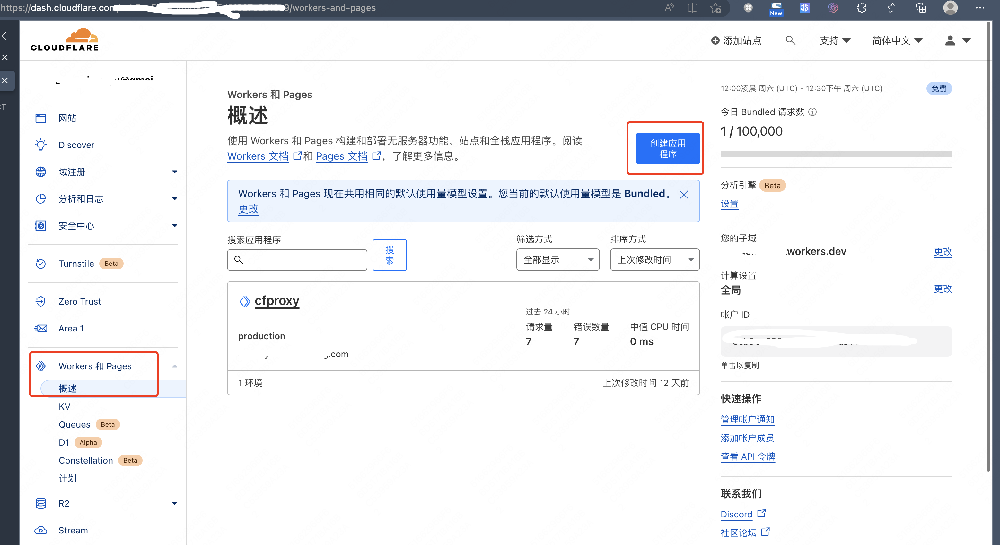
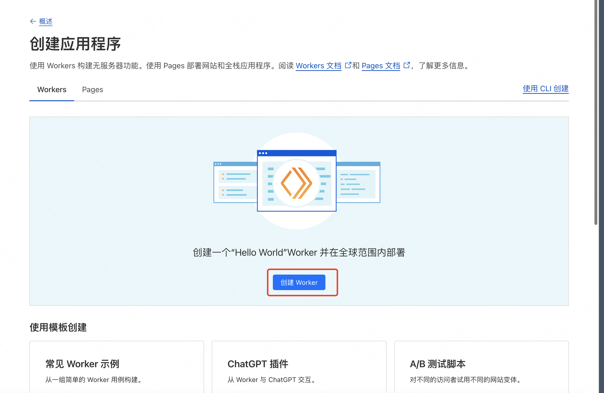
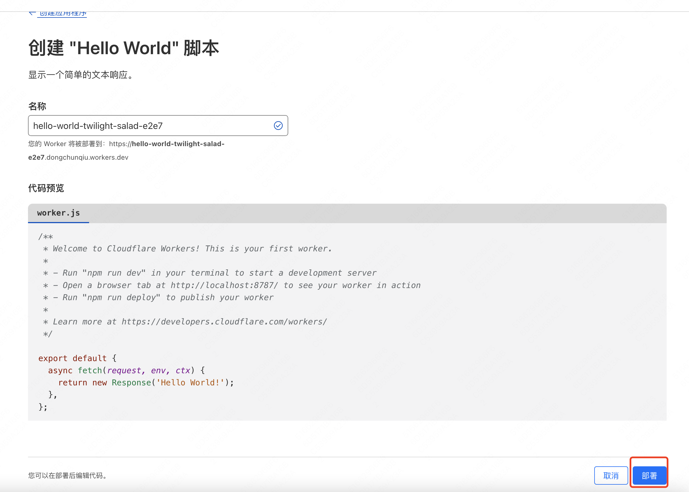
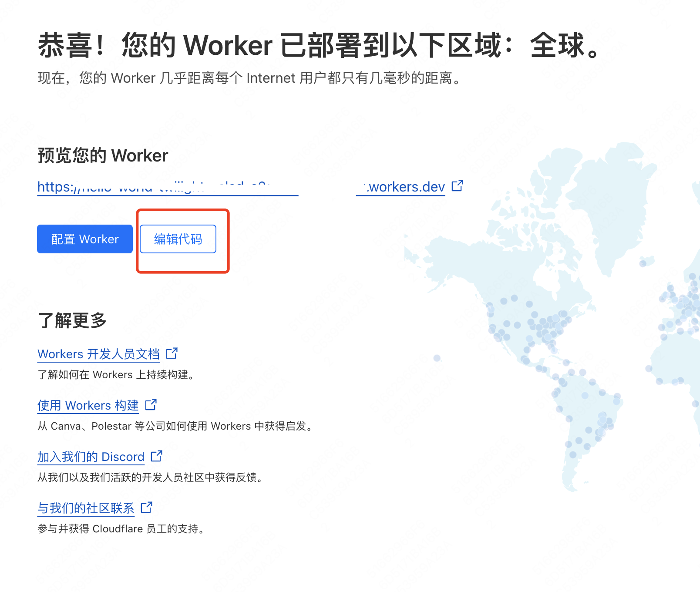
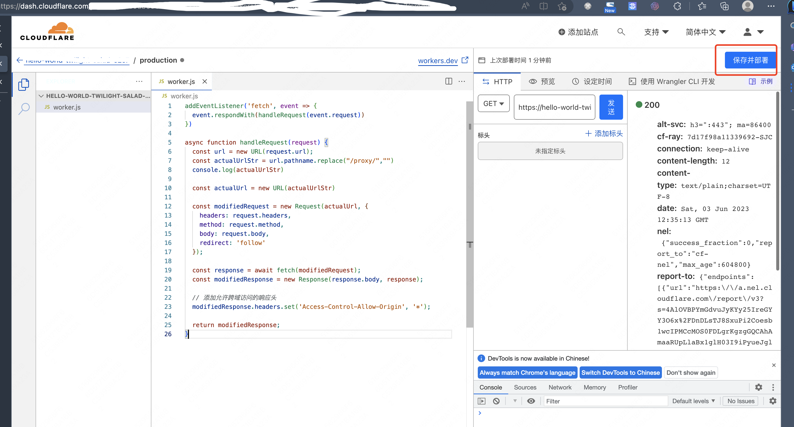

# full-forward-proxy

本项目是 cloudflare 前向代理。在 cloudflare 网站中新建 worker，把 worker.js 文件中的内容复制进去即可使用。

使用方法为在任意 url 前面加上 https://你的域名/proxy/ 即可使用 cloudflare 加速。

例如 https://forward.paperai.life/proxy/https://github.com/14790897

# 详细步骤

1. 登录https://www.cloudflare.com
2. 创建应用程序
   
3. 创建 worker（pages 麻烦一点，需要写一个 package.json 文件，但 pages 的好处是分配的域名直接可以用）
   
4. 点"部署"按钮
   
5. 编辑代码
   
6. 把 worker.js 文件中的内容复制进去，点"保存并部署"
   
7. (可选) 添加自定义域

# 功能

- 代理功能：拦截并通过 Cloudflare Worker 转发到目标网站的请求。
- 自动 URL 重写：修改 HTML 内容中的相对 URL，使它们通过代理加载。
- Cookie 记录：在 Cookie 中存储当前访问的目标网站，以便处理后续特殊地直接对根路径请求时不需要再次提供完整的 URL。
- 重写 fetch 和 XMLHttpRequest：在 HTML 页面中注入 JavaScript，确保通过 fetch 或 XMLHttpRequest 动态加载的内容也通过代理进行。

# 使用方法

在任意 url 前面加上 https://你的域名/proxy/ 即可使用 cloudflare 加速。

# 未完成

使用 service worker 代理全部请求

# acknowledgement: https://github.com/gaboolic/cloudflare-reverse-proxy/tree/main
